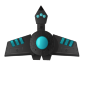

# **Spaceship game**



## Introduction

This project is a browser game,the game is about destroying
enemy spaceships, but unfortunately app isn't available for
small screens like smartphone

### Technology used :

-   **ExpressJS** **8.14.0**
-   **Typescript**
-   **Scss**
-   **Pug**

---

## **Getting Started**

1.  First you need make sure you have installed nodeJs version v16.16.0 or higher

1.  If nodeJs is installed you need install all necessary dependencies to this project just run on shell

```
npm install
```

### **Available scripts**

In the project directory, you can run:

```
npm run build
```

Runs the app in the development mode but app also use proxy server
so you need to run server in the same directory run:

```
npm run dev
```

Open http://localhost:5000 or http://localhost:3000 to view it in your browser.

---

## **Deployment**

To create directory with production version of this app run :

```
npm run prod
```
